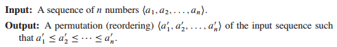
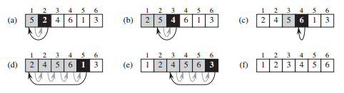
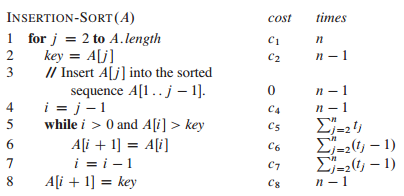
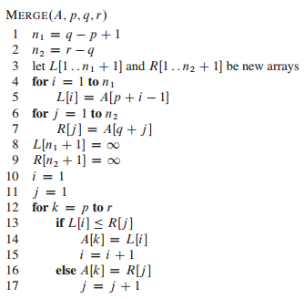
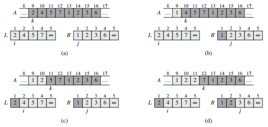
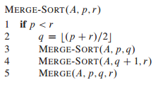
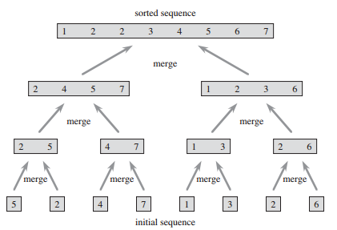
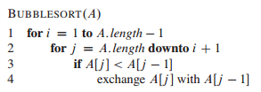

# 2 Getting Started 

## 复习要点

1. 插入排序：原理，伪代码，效率分析，特点（就地，稳定性）
2. 合并排序：原理，伪代码，效率分析，特点


## 2.1 Insertion sort

插入排序问题描述：

想象为打扑克时，抓牌时给手中的牌排序

插入排序示意图：


伪代码：
```C++
INSERTION-SORT(A)
1 for j = 2 to A.length
2   key = A[j]
3   i = j - 1
4   while i > 0 and A[i] > key
5    A[i + 1] = A[i]
6    i = i - 1
7   A[i + 1] = key // 这一步是否有必要？(必须要的)
```

**Loop invariant and the correctness of insertion**

插入排序的Loop invariant:
> At the start of each iteration of the for loop of lines 1–8, the subarray A[1..j - 1] consists of the elements originally in A[1..j - 1], but in sorted order.

插入排序的三要素：

1. Initialization: 开始迭代时是正确的
2. Maintenance: 如果上一次迭代是正确的，那么下一次迭代也是正确的
3. Termination: 循环结束后能够判断正确性

## 2.2 Analyzing algorithms

>Analyzing an algorithm has come to mean predicting the resources that the algorithm requires.

**Random-Access Machine**

### Analysis of insortion sort



## 2.3 Designing algorithm
### 2.3.1 The divide-and-conquer approach

1. **Divide** the problem into a number of subproblems that are smaller instances of the same problem
2. **Conquer** the subproblems by solving them recursively. If the subproblem sizes are small enough, however, just solve the subproblems in a straitforward manner.
3. **Combine** the solutions to the subproblems into the solution for the original problem.

Merge:
merge 伪代码



mergesort 原理



mergesort 伪代码



### 2.3.1 Analyzing divide-and-conquer algorithms




