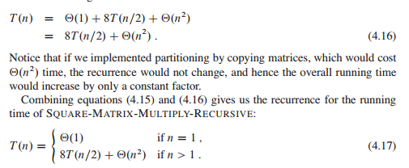

# 4 Divide-and-Conquer

## 复习要点
1. 解决递归问题时间复杂度的三种方法：替换法，递归树法和主方法
2. 求数组的一个子数组，使得其元素之和最大（伪代码，复杂度分析）

#### Recurrences

Three methods for solving the recurrences:
* **substitution method**: guess a bound and then use mathematical induction to prove
* **recursion-tree method**: converts the recurrence into a tree whose nodes represent the costs incurred at various levels of the recursion.
* **master method**: provides bounds for recurrences of the form T(n) = aT(n/b) + f(n), where a >= 1, b > 1

## 4.1 The maximum-subarrays problem
1. 问题描述：


2. 相关伪代码与分析：

跨数组最大子数组：


伪代码：


算法分析：


Exercises:

4.1.1 What does FIND-MAXIMUM-SUBARRAY return when all elements of A are negative?

the smallest element

4.1.2 Write pseudocode for the brute-force method of solving the maximum-subarray problem.

```C++
BRUTE-FORCE(A)
max = -infinite
left = -1
right = -1
sum = 0
for i = 0 to A.length - 1
  for j = i + 1 to A.length 
    if i < j
      sum += A[i]
      i = i + 1
    if sum > max 
      max = sum
      left = i
      right = j
return (left, right, max)
```

## 4.2 Strassen's algorithm for matrix multiplication

 
 
 

## 4.3 The substitution method for solving recurrence

## 4.4 The recursion-tree method for solving recurrence

1. 判断树的层数
2. 判断各层叶子数

## 4.5 The master method for solving recurrences

The master theorem:


注意


