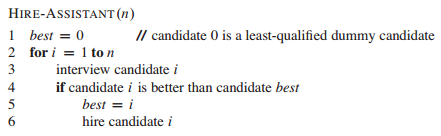
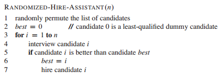
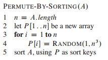
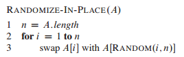

# 5 Probabilistic Analysis and Randomized Algorithms

（只是了解了基本内容，全章内容并未读完，特别是后几节20170316）

1. The hiring problem:

问题描述：面试一堆人，选出最优。但面试一个人后就要决定去留，所以如果当前被面试的人比已雇佣的人好，就雇佣此人，解聘在职的人。面试一个人的费用比雇用一个人的费用（含解聘已在职的人）要低。

算法描述：

算法分析：不用于前面的问题，这个问题关注的是如何使费用最低，故不是分析算法运行时间。但实质上又有相同点，最后都会关注基本操作的次数。

与此计算模型相同的问题还有在一个序列中寻找最大值与最小值（都需要维持一个当前最优）。

2. 概率分析：用概率论的方法对算法进行分析，如平均运行时间，雇人问题中的平均开销。这里要对输入的分布有个假设。

3. 随机化算法：为了应用概率分析，我们要知道输入的分布，但有时候对于输入很难知道其情况，或知道了也难以对其进行计算建模，这是就要用的概率与随机性的方法进行建模。随机化算法是指，算法的行为不仅取决于输入还取决于随机数产生器产生的值。

平均情况运行时间：算法输入分布具有随机性

期望运行时间：算法对输入进行随机选择

4. 指示随机变量：值为0或1，指示时间是否发生。指示随机变量的期望即为事件发生的概率，这就给很多问题的分析带来了方面，如重复随机实验中，求某时间发生的次数。雇人模型中，雇人次数的期望的分析。

5. 概率分析于随机化算法的不同：对于概率分析方法，具体的算法对于同样的输入，算法的执行是一样的。而随机化算法，每次操作都会首先对输入进行一次随机化处理，每次算法的执行都可能是不同的。例如对于雇人模型中，如果都是按照逆序的输入，那么每次同样的输入都只需要雇佣一次，而随机化算法因为会重新打乱顺序，所以每次的雇佣次数是不同的。

雇人模型的随机化算法：

6. 随机化数组的方法：
* 给元素随机的赋优先级，然后依据优先级对原数组进行排序

* 就地重排：

