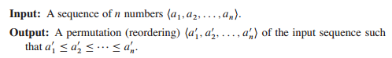
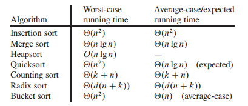
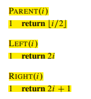
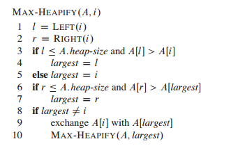
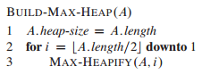
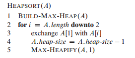

# Sorting and Order Statistics

1. 排序问题描述：

2. 对于较复杂数据结构，排序应该对指针进行排序
3. 为什么排序：有些应用问题需要，是某些问题的一个子问题，。。。
4. 比较排序的极限，一些常见排序算法效率比较：

5. 顺序统计量：第i个最大/最小的统计量。解决方法：先排序，再去元素，效率取决于排序算法；还有更高效的算法。

# 6 Heapsort

1. heapsort 的特点：时间复杂度同merge sort，就地排序像插入排序，只有常数个数组存储于输入数组之外。
2. heap数据结构：是一个完全二叉树，树的每个节点对应于数组的一个元素，树的节点的个数要小于数组元素的个数。给出一个节点的索引可以轻易的求出其父节点和子节点的索引，算法流程如图：(可以用移位的操作实现，设计成宏或内联函数)

3. 堆分为最小堆和最大堆，它们都满足堆的性质：以最大堆为例，A[parent(i)] >= A[i];可以用堆的数据结构实现优先队列。

4. 关于堆的一些函数及运行效率：MAX-HEAPIFY, BUILD-MAX-HEAP, HEAPSORT, MAX-HEAP-INSERT, HEAP-EXTRACT-MAX, HEAP-INCREASE-KEY, HEAP-MAXIMUM。

5. MAX-HEAPIFY:维持最大堆，输入为数组A及数组的一个索引i，假设索引i的两个子节点都是最大堆，伪代码：

时间复杂度（T(n) < T(2n/3) + O(1),  O(lgn),O(h)）.

6. BUILD-MAX-HEAP:

7. HEAPSORT:

8. 编程实现总结：伪代码中的索引是从1开始的，所以一定要注意实现的时候是从0开始的，一样的要注意更改。伪代码完成再实现，编码完成后检查一遍再编译运行。

