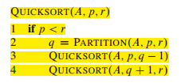
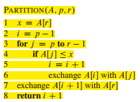
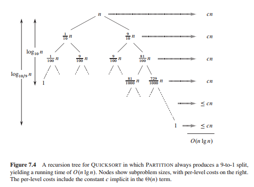
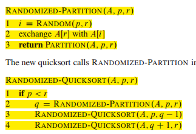

# Quicksort

1. 快排：最坏时间O(n**2), 平均O(nlgn),就地，常数因子很小，实际中经常运用
2. quicksort分而治之的三个步骤：

分：将数组分成两个部分，一个部分比一个元素小，一个部分比一个元素大。

Conquer: 对两个子数组进行quicksort排序

Combine: 数组已是有序，无需再做其他工作

3. quicksort的伪代码：

4. 划分数组的伪代码：

5. 划分的最坏情况，选择的pivot是最小的元素或是最大的元素，最好的情况：二分（不是二分情况也很好）

6. 随机化快排：

