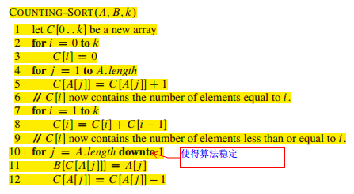
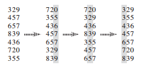
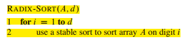

# 8 Sorting in Linear Time

1. 由决策树模型可知比较模型的排序方法最好的情况是O(nlgn)。

2. 计算排序（counting sort）：假设待排序的数组为整数数组（且最大值不要太大）,且非负

伪代码：

3. 基排序（radix sort）：起源于卡片机时代，从最低位开始排序，直至最高位。

示意图：

伪代码：

4. 桶排序（bucket sort）：暂略
