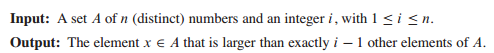
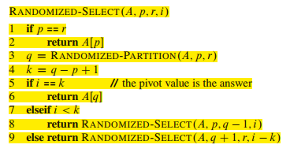
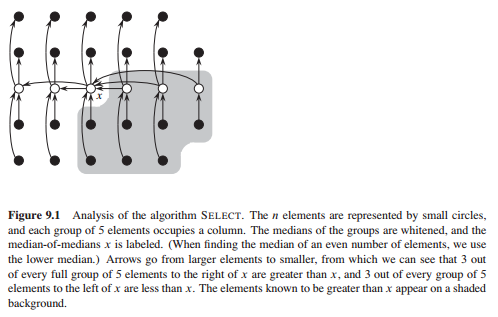

# 9 Medians and Order Statistics

1. 一个集合的第i个顺序统计量就是第i小的元素,这个选择问题描述为：

2. 单纯的求最大最小，O(n)时间即可。

3. 同时找到最大和最小，2(n - 1)即可，但还可更优，达到3n/2。每次选择一对去比较，大的与当前最大的比，小的与当前最小的比。

4. 随机化选择法：利用随机划分的方法，根据返回的值进行判断，与快速排序不同的是，这里问题的规模是减小的且只有一个。

最坏情况：O(n**2)， 平均情况：O(n)

5. 最坏情况为O(n)的算法：

时间复杂度分析见课本