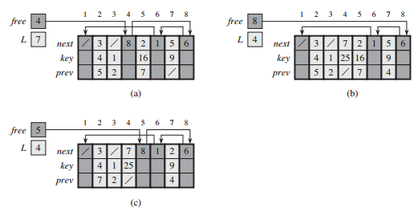

# Elementary Data Structures

待解问题：
- [ ] 10.2-7
- [ ] 10.2-8
- [ ] 10.4-5
- [ ] 10.4-6
- [ ] Problems


1. 栈的操作：

```C
STACK-EMPTY(S)
if S.top == 0
    return TRUE
else return FALSE
```
```C
PUSH(S, x)
S.top = S.top + 1
S[S.top] = x
```
```C
POP(S)
if STACK-EMPTY(S)
    error "underflow"
else S.top = S.top - 1
    return S[S.top + 1]
```

2. 队列的操作：
```C
ENQUEUE(Q, x)
Q[Q.tail] = x
if Q.tail == Q.length
    Q.tail = 1;
else
    Q.tail = Q.tail + 1
```
```C
DEQUEUE(S)
x = Q[Q.head]
if Q.head = Q.length
    Q.head = q
else Q.head = Q.head + 1
return x
```

3. 链表：

单链/双链，已排序/未排序，循环/非循环

```C
LIST-SEARCH(L, k)
x = L.head
while x != NIL and x.key != k
    x = x.next
return x
```
```C
LIST-INSERT(L, x)
x.next = L.head
if L.head != NIL
    L.head.prev = x
L.head = x
x.prev = NIL
```
```C
LIST-DELETE(L, x)
if x.prev != NIL
    x.prev.next = x.next
else L.head = x.next
if x.next != NIL
    x.next.prev = x.prev
```
增加哨兵后：
```C
LIST-DELETE(L, x)
x.prev.next = x.next
x.next.prev = x.prev
```
```C
LIST-INSERT(L, x)
x = L.nil.next
while x != L.nil and x.key != k
     x = x.next
return x
```
```C
LIST-INSERT(L, x)
x.next = L.nil.next
L.nil.next.prev = x
L.nil.next = x
x.prev = L.nil
```
哨兵不能降低渐进时间界，但能降低常数因子；使代码简洁而非提高速度

4. 指针和对象的实现

对象的多数组表示：


对象的单数组表示：(多数组比单数组容易管理)


对象的分配与释放：




6. 有根树的表示方法：


