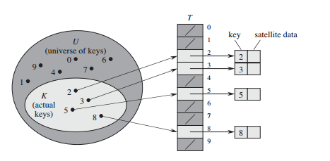
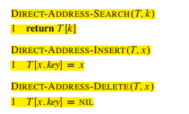
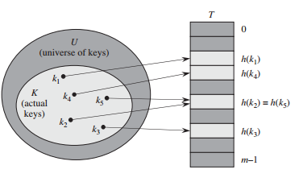
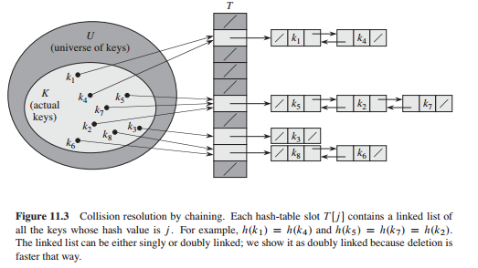
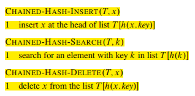
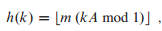
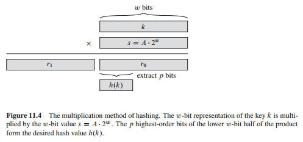
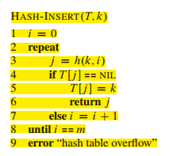
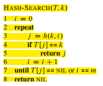
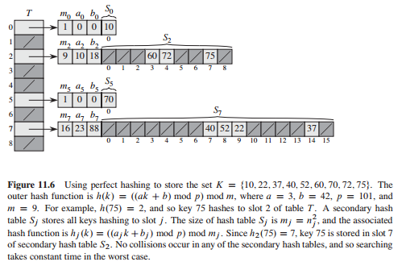

# 11 Hash Tables

待解问题：

- [ ] 11.1-3
- [ ] 11.1-4
- [ ] 11.2-5
- [ ] 11.2-6

1. 直接寻址表

2. 散列表

3. 散列函数（练习未看）

好的散列函数的特点：

将关键字转换为自然数：

除法散列法： h(k) = k mod m

m值的选择：不太接近2的整数幂的素数

乘法散列法：

4. 全域散列法：
随机选择散列函数，使之独立于要存储的关键字，一组精心设计的散列函数

5. 开放寻址法：
所有的元素都存放在散列表里，不用指针， 探查 线性探查  二次探查  双重散列

此种方法中，删除元素比较困难，有删除关键字的操作中，一般不采用此方法

6. 完全散列(perfect hash):

集合为静态时， 两级散列

