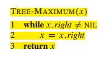

# 12. Binary Search Tree

- [ ] 12.1-3
- [ ] 12.1-5

1. 什么是二叉搜索树

> 设x是二叉搜索树的一个节点，如果y是x左子树中的一个节点，那么y.key <= x.key。如果y是右子树中的一个节点，那么y.key >= x.key。

先序遍历  中序遍历  后序遍历

2. 查询二叉搜索树

查询：

最大与最小：

后继与前驱：

3. 插入和删除

插入：

删除：

4. 随机构建二叉搜索树

